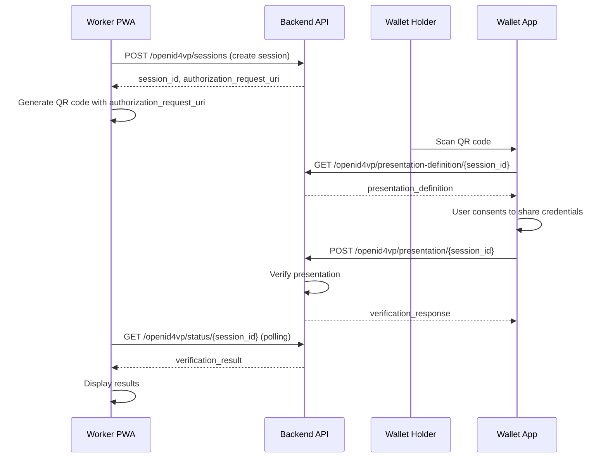

# Design Document: OpenID4VP Integration

## Overview

This design document outlines the integration of OpenID4VP (OpenID for Verifiable Presentations) protocol into the existing Inji Offline Verify Platform. The integration will provide a standardized, secure online verification flow that complements the existing offline QR code verification capabilities.

The OpenID4VP integration follows the cross-device flow pattern where the verifier generates a QR code containing an authorization request, the wallet holder scans it, retrieves the presentation definition, submits their verifiable presentation, and the verifier polls for results.

## Architecture

### High-Level Flow



### Component Architecture

The integration spans three main components:

1. **Worker PWA Frontend**: Enhanced UI for OpenID4VP verification
2. **Backend API**: New Django endpoints implementing OpenID4VP protocol
3. **SDK Integration**: Reuse existing verification logic for presentation validation

## Components and Interfaces

### 1. Backend API Endpoints

#### Session Management Service
```python
class OpenID4VPSessionService:
    def create_session(self, presentation_definition_id: str, organization_id: str) -> OpenID4VPSession
    def get_session(self, session_id: str) -> Optional[OpenID4VPSession]
    def update_session_status(self, session_id: str, status: str, result: dict) -> None
    def cleanup_expired_sessions(self) -> None
```

#### OpenID4VP Endpoints
- `POST /api/openid4vp/sessions/` - Create verification session
- `GET /api/openid4vp/presentation-definition/{session_id}/` - Get presentation definition
- `POST /api/openid4vp/presentation/{session_id}/` - Submit verifiable presentation
- `GET /api/openid4vp/status/{session_id}/` - Poll verification status

#### Data Models
```python
class OpenID4VPSession(models.Model):
    session_id = models.UUIDField(primary_key=True, default=uuid.uuid4)
    organization = models.ForeignKey(Organization, on_delete=models.CASCADE)
    presentation_definition_id = models.CharField(max_length=100)
    status = models.CharField(max_length=20, default='pending')
    created_at = models.DateTimeField(auto_now_add=True)
    expires_at = models.DateTimeField()
    verification_result = models.JSONField(null=True, blank=True)
    error_message = models.TextField(null=True, blank=True)
```

### 2. Worker PWA Frontend

#### OpenID4VP Verification Component
```typescript
interface OpenID4VPVerificationProps {
  presentationDefinitionId: string;
  onVerificationComplete: (result: VerificationResult) => void;
  onError: (error: Error) => void;
}

class OpenID4VPVerificationComponent {
  private sessionId: string | null = null;
  private pollingInterval: NodeJS.Timeout | null = null;
  
  async initiateVerification(): Promise<void>
  private generateQRCode(authorizationRequestUri: string): void
  private startPolling(): void
  private stopPolling(): void
  private handleVerificationResult(result: VerificationResult): void
  private logVerificationResult(result: VerificationResult): Promise<void> // Logs to same system as offline
}
```

#### Organization Dashboard Integration
The existing organization dashboard will automatically display OpenID4VP verification logs alongside offline verification logs:

```typescript
// Existing VerificationLogsTable component will show both types
interface VerificationLogEntry {
  id: string;
  timestamp: Date;
  workerName: string;
  verificationMethod: 'offline_qr' | 'openid4vp'; // New field
  status: 'success' | 'failure';
  credentialType: string;
  // ... other existing fields
}

// Dashboard will filter and display both verification types
class VerificationLogsService {
  async getVerificationLogs(organizationId: string): Promise<VerificationLogEntry[]> {
    // Returns both offline and OpenID4VP logs in same format
  }
}
```

#### Session Management
```typescript
interface OpenID4VPSession {
  sessionId: string;
  authorizationRequestUri: string;
  status: 'pending' | 'completed' | 'expired' | 'error';
  createdAt: Date;
  expiresAt: Date;
}

class OpenID4VPSessionManager {
  async createSession(presentationDefinitionId: string): Promise<OpenID4VPSession>
  async getSessionStatus(sessionId: string): Promise<SessionStatus>
  private buildAuthorizationRequestUri(sessionId: string): string
}
```

### 3. Presentation Definition Management

#### Presentation Definition Service
```python
class PresentationDefinitionService:
    def get_presentation_definition(self, definition_id: str) -> dict
    def validate_presentation_against_definition(self, presentation: dict, definition: dict) -> bool
```

#### Presentation Definitions
```json
{
  "MOSIP_ID": {
    "id": "mosip-id-verification",
    "input_descriptors": [
      {
        "id": "mosip_identity_credential",
        "format": {
          "ldp_vc": {
            "proof_type": ["Ed25519Signature2020"]
          }
        },
        "constraints": {
          "fields": [
            {
              "path": ["$.type"],
              "filter": {
                "type": "array",
                "contains": {
                  "const": "MOSIPIdentityCredential"
                }
              }
            }
          ]
        }
      }
    ]
  }
}
```

## Data Models

### OpenID4VP Session Model
```python
class OpenID4VPSession(models.Model):
    session_id = models.UUIDField(primary_key=True, default=uuid.uuid4)
    organization = models.ForeignKey(Organization, on_delete=models.CASCADE)
    created_by = models.ForeignKey(User, on_delete=models.CASCADE)
    presentation_definition_id = models.CharField(max_length=100)
    status = models.CharField(
        max_length=20,
        choices=[
            ('pending', 'Pending'),
            ('completed', 'Completed'),
            ('expired', 'Expired'),
            ('error', 'Error')
        ],
        default='pending'
    )
    created_at = models.DateTimeField(auto_now_add=True)
    expires_at = models.DateTimeField()
    verification_result = models.JSONField(null=True, blank=True)
    error_message = models.TextField(null=True, blank=True)
    
    class Meta:
        db_table = 'openid4vp_sessions'
        indexes = [
            models.Index(fields=['status', 'expires_at']),
            models.Index(fields=['organization', 'created_at']),
        ]
```

### Verification Log Integration
```python
# Extend existing VerificationLog model to support OpenID4VP
class VerificationLog(models.Model):
    # ... existing fields (organization, verified_by, verification_status, etc.) ...
    verification_method = models.CharField(
        max_length=20,
        choices=[
            ('offline_qr', 'Offline QR'),
            ('openid4vp', 'OpenID4VP')
        ],
        default='offline_qr'
    )
    openid4vp_session = models.ForeignKey(
        OpenID4VPSession, 
        on_delete=models.SET_NULL, 
        null=True, 
        blank=True
    )
    
    # Same fields as offline verification:
    # - organization (for dashboard filtering)
    # - verified_by (worker who performed verification)
    # - verification_status (success/failure)
    # - credential_data (verified credential information)
    # - created_at (timestamp for dashboard display)
```

#### Verification Log Service Integration
```python
class VerificationLogService:
    def create_openid4vp_log(
        self, 
        session: OpenID4VPSession, 
        verification_result: dict,
        verified_by: User
    ) -> VerificationLog:
        """Create verification log entry for OpenID4VP verification"""
        return VerificationLog.objects.create(
            organization=session.organization,
            verified_by=verified_by,
            verification_method='openid4vp',
            verification_status=self._map_verification_status(verification_result),
            credential_data=verification_result.get('credentials', []),
            openid4vp_session=session
        )
```

## Error Handling

### Error Types and Responses
```python
class OpenID4VPError(Exception):
    def __init__(self, error_code: str, description: str, http_status: int = 400):
        self.error_code = error_code
        self.description = description
        self.http_status = http_status

# Standard OpenID4VP error responses
OPENID4VP_ERRORS = {
    'invalid_request': 'The request is missing a required parameter or is malformed',
    'invalid_session': 'The session identifier is invalid or expired',
    'unsupported_presentation_format': 'The presentation format is not supported',
    'verification_failed': 'The presentation verification failed',
    'expired_session': 'The verification session has expired'
}
```

### Frontend Error Handling
```typescript
interface OpenID4VPError {
  code: string;
  message: string;
  details?: any;
}

class OpenID4VPErrorHandler {
  static handleError(error: OpenID4VPError): void {
    switch (error.code) {
      case 'invalid_session':
      case 'expired_session':
        // Show session expired message, offer to restart
        break;
      case 'verification_failed':
        // Show verification failure details
        break;
      case 'network_error':
        // Show network connectivity issues
        break;
      default:
        // Show generic error message
        break;
    }
  }
}
```

## Testing Strategy

### Unit Testing
- **Backend API endpoints**: Test each OpenID4VP endpoint with valid/invalid inputs
- **Session management**: Test session creation, expiration, and cleanup
- **Presentation verification**: Test verification logic with various presentation formats
- **Error handling**: Test error responses and edge cases

### Integration Testing
- **End-to-end flow**: Test complete OpenID4VP flow from QR generation to result display
- **Cross-device simulation**: Test QR code scanning and presentation submission
- **Polling mechanism**: Test real-time result updates
- **Session timeout**: Test session expiration and cleanup

### Property-Based Testing
Property-based tests will be implemented to validate universal correctness properties across the OpenID4VP integration.

## Correctness Properties

*A property is a characteristic or behavior that should hold true across all valid executions of a system-essentially, a formal statement about what the system should do. Properties serve as the bridge between human-readable specifications and machine-verifiable correctness guarantees.*

### Property 1: Session Generation and Security
*For any* OpenID4VP verification request, the system should generate a cryptographically secure, unique session identifier that is included in the QR code and links to the verification request.
**Validates: Requirements 1.1, 1.4, 6.1**

### Property 2: QR Code Authorization Request Structure
*For any* generated QR code, it should contain a properly formatted OpenID4VP authorization request URL that includes the presentation definition endpoint URL.
**Validates: Requirements 1.2, 1.3**

### Property 3: Configurable Session Expiration
*For any* verification session, it should expire after the configured timeout period and be automatically cleaned up from the system.
**Validates: Requirements 1.5, 6.3, 6.5**

### Property 4: OpenID4VP Endpoint Validation
*For any* request to OpenID4VP endpoints (`/presentation-definition/`, `/presentation/`, `/status/`), the system should validate the session identifier and return appropriate responses or errors.
**Validates: Requirements 2.1, 2.2, 2.3, 2.4, 2.5**

### Property 5: Presentation Definition Generation
*For any* verification request, the system should generate a presentation definition that includes proper input descriptors, acceptable credential formats, and any configured issuer constraints.
**Validates: Requirements 3.1, 3.2, 3.3, 3.4**

### Property 6: Comprehensive Presentation Verification
*For any* submitted verifiable presentation, the system should validate the presentation signature, check each contained credential's signature, verify revocation status if applicable, and ensure the presentation matches the requested definition.
**Validates: Requirements 4.1, 4.2, 4.3, 4.4, 4.5**

### Property 7: Real-time Polling and Result Display
*For any* active verification session, the Worker PWA should poll the status endpoint at the configured interval and immediately display results when they become available, stopping polling when the session completes or expires.
**Validates: Requirements 5.1, 5.2, 5.3, 5.4, 5.5**

### Property 8: Session State Management
*For any* verification session, the system should store all required session state, prevent reuse after successful verification, and maintain session integrity throughout the verification process.
**Validates: Requirements 6.2, 6.4**

### Property 9: Comprehensive Error Handling
*For any* error condition (communication failures, verification failures, network issues), the system should provide specific error messages, log the errors for audit purposes, and offer retry options for recoverable errors.
**Validates: Requirements 7.1, 7.2, 7.3, 7.4, 7.5**

### Property 10: Integration Compatibility and Unified Logging
*For any* existing system functionality (authentication, organization management, offline verification), it should continue to work unchanged after OpenID4VP integration, with OpenID4VP verification logs stored in the same database table and displayed on the organization dashboard alongside offline verification logs.
**Validates: Requirements 8.2, 8.3, 8.4, 8.5**

### Property 11: Presentation Definition Round Trip
*For any* valid presentation definition, retrieving it from the endpoint should return an equivalent definition that can be used by wallet applications to construct valid presentations.
**Validates: Requirements 2.1, 3.5**

## Testing Strategy

### Dual Testing Approach

This feature will be validated using both unit tests and property-based tests to ensure comprehensive coverage:

- **Unit tests**: Verify specific examples, edge cases, and error conditions
- **Property tests**: Verify universal properties across all inputs using randomized testing

### Unit Testing Focus Areas

- **API endpoint behavior**: Test each OpenID4VP endpoint with specific valid and invalid inputs
- **Session lifecycle**: Test session creation, expiration, and cleanup with specific scenarios
- **Error conditions**: Test specific error scenarios and edge cases
- **Integration points**: Test interaction with existing authentication and logging systems

### Property-Based Testing Configuration

Property-based tests will be implemented using Jest with the `fast-check` library for TypeScript/JavaScript components and `hypothesis` for Python backend components. Each property test will:

- Run a minimum of 100 iterations to ensure comprehensive input coverage
- Be tagged with comments referencing the design document property
- Use the format: **Feature: openid4vp-integration, Property {number}: {property_text}**

### Property Test Implementation Strategy

1. **Session Generation Properties**: Generate random verification requests and validate session uniqueness and security
2. **QR Code Properties**: Generate random sessions and validate QR code structure and content
3. **API Endpoint Properties**: Generate random valid and invalid requests to test endpoint behavior
4. **Verification Properties**: Generate random presentations (valid and invalid) to test verification logic
5. **Error Handling Properties**: Generate random error conditions to test error handling and recovery

### Integration Testing

- **End-to-end OpenID4VP flow**: Test complete flow from QR generation to result display
- **Cross-device simulation**: Test QR code scanning and presentation submission across devices
- **Concurrent session handling**: Test multiple simultaneous verification sessions
- **Session timeout and cleanup**: Test session expiration and automatic cleanup processes
- **Backward compatibility**: Ensure existing offline verification continues to work unchanged

The testing strategy ensures that both specific examples work correctly (unit tests) and that universal properties hold across all possible inputs (property tests), providing comprehensive validation of the OpenID4VP integration.