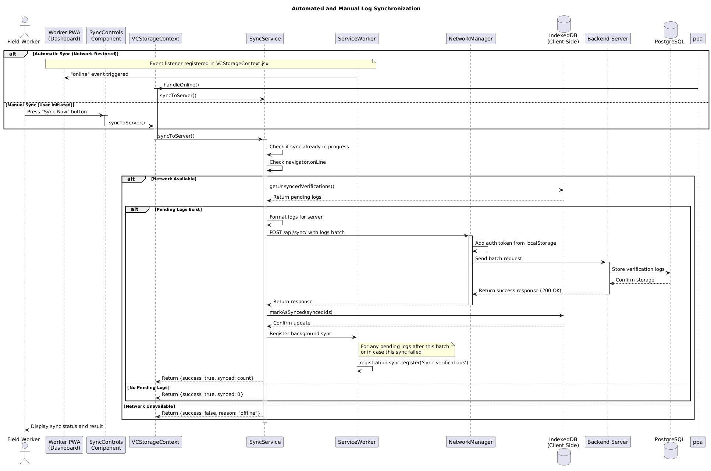

# Inji Offline Verify Platform


## Table of Contents
- [Quick Start](#quick-start)
- [Local Development](#local-development)
- [Deployment](#deployment)
- [Component Overview](#component-overview)
- [Basic Workflow](#basic-workflow)
- [Performance Benchmarks](#performance-benchmarks)
- [Documentation](#documentation)

---

## Overview

The **Inji Offline Verify Platform** is a comprehensive solution for verifiable credential verification that operates seamlessly both online and offline. Built in alignment with the [MOSIP Inji Verify problem statement](https://www.mosip.io/pdf/Inji_Verify_Offline_Verification.pdf), this monorepo delivers enterprise-grade verification capabilities for organizations managing field operations where network connectivity is unreliable.
### How It Works - Complete Process Flow

**Organization Setup & Management:**
- **Organization Registration**: Supervisors register their organization through a secure email OTP verification process
- **Worker Management**: Admins create field worker accounts and manage organizational settings through the web portal
- **Trust Infrastructure**: Organizations configure trusted issuer DIDs, public keys, and revocation lists for their verification ecosystem
- **Cache Provisioning**: System automatically downloads and caches cryptographic materials (issuer keys, JSON-LD contexts, DID documents, revocation lists) for offline operations

**Field Worker Operations:**
- **Credential Scanning**: Workers use the PWA to scan QR codes containing verifiable credentials or upload credential files directly
- **Dual Verification Modes**: 
  - **Online Verification**: Real-time validation with live issuer key resolution and revocation checking
  - **Offline Verification**: Complete cryptographic validation using cached materials when network is unavailable
- **Evidence Logging**: All verification results are immediately stored in local IndexedDB with tamper-evident timestamps and digital signatures
- **Verification History**: Workers can view their complete verification history, filter results, and track sync status

**Synchronization & Oversight:**
- **Intelligent Sync**: Verification logs automatically sync to the central server when connectivity returns, with manual sync options available
- **Supervisor Dashboard**: Real-time visibility into organizational verification activities, performance metrics, and audit trails
- **Export & Reporting**: Comprehensive data export capabilities in CSV/JSON formats for compliance and analysis


**Mission**: Enable trusted, cryptographically-assured credential verification anywhere, anytime—even when the network disappears.

### What Makes This Special?

- **Complete Offline Operation**: Full verification capability without internet after initial sync
- **Multi-Tenant Architecture**: Secure organization isolation with role-based access
- **PWA-First Design**: Installable on any device with native app-like experience  
- **Cryptographic Assurance**: Supports Ed25519, RSA, ES256K, and More.
- **Real-time Analytics**: Performance monitoring and audit trails
- **Smart Sync**: Intelligent background synchronization when connectivity returns

---

## Key Features

### Mandatory Tasks - All Delivered

All mandatory requirements from the MOSIP Inji Verify problem statement have been successfully implemented and are production-ready:

| **Task** | **Description** |
|----------|-----------------|
| **UI/UX Design** | User-friendly interfaces for both worker PWA and organization portal with Material-UI components |
| **QR Code Scanner Integration** | Reliable QR code scanner using webcam/phone camera with real-time VC detection |
| **SDK Integration** | Complete integration of Inji Verify SDK for offline VC validation with signature check, schema validation, and cached revocation status |
| **Local Data Storage** | Robust IndexedDB implementation for persistent verification results and evidence logs |
| **Connectivity Detection** | Accurate online/offline status detection with browser APIs and network event listeners |
| **Synchronization Mechanism** | Automatic background upload of stored logs to Django backend when connectivity restored |
| **Error Handling** | Clear user feedback for invalid VCs, scanning errors, sync failures with detailed error messaging |
| **Basic Security** | Input validation, secure data handling, JWT authentication, and encrypted evidence storage |

### Good-to-Have Tasks - All Completed
| **Task** | **Description** |
|----------|-----------------|
| **Revocation Handling (Pre-cached)** | Pre-cached revocation lists with whitelist/blacklist of known revoked VCs and issuers for offline checks. Includes W3C BitstringStatusList implementation ([IMPLEMENTATION GUIDE](./packages/inji-verify-sdk/BITSTRING_STATUS_LIST.md)) |
| **Configurable Sync Endpoint** | Configurable backend endpoints through environment variables and organization settings |
| **Filtering/Searching Logs** | Advanced filtering and search capabilities through verification history with date ranges and status filters |
| **Export Logs** | Export functionality for local logs in CSV/JSON formats with comprehensive data export |
| **Multi-VC Scanning** | Sequential scanning of multiple VCs with batch processing and individual result tracking |
| **Dockerization** | Complete Docker Compose setup for all deployable components with production configurations |

### Bonus Tasks - All Delivered

| **Task** | **Description** |
|----------|-----------------|
| **DID Resolution (Limited Offline)** | Advanced caching strategies for DIDs enabling offline resolution for frequently used issuers |
| **Proof-of-Concept Native Mobile** | PWA provides native-like mobile experience with installability and offline capabilities on Android/iOS ([NATIVE APP README](https://github.com/SartMa/inji-offline-app/blob/master/README.md)) |
| **Performance Benchmarking** | Comprehensive performance measurement of offline verification (74ms average) and sync processes with 1,500+ sample analysis |
| **Offline Credential Presentation** | Offline VP verification |

### Technical Capabilities

**Credential Formats Supported:**
- **LDP VCs** (Linked Data Proof Verifiable Credentials) - Full offline verification
- **Verifiable Presentations** - Ed25519Signature2020 proof verification

**Cryptographic Signature Suites:**
- **Ed25519Signature2020** - Primary signature suite for VPs
- **Ed25519Signature2018** - Legacy Ed25519 signatures  
- **Ed25519Signature2020** - Modern Ed25519 implementation for VCs
- **RsaSignature2018** - RSA-based signatures for VCs
- **EcdsaSecp256k1Signature2019** - Secp256k1 curve signatures using noble crypto
- **DataIntegrityProof** - With ecdsa-rdfc-2019 cryptosuite

**Offline Capabilities:**
- **Storage**: IndexedDB for credential cache and evidence logs
- **Document Loader**: Offline-first JSON-LD context resolution  
- **Key Resolution**: Cached public key and DID document resolution
- **Sync Strategy**: Background sync, manual triggers, online event listeners
- **Security**: JWT-based authentication, encrypted evidence storage

---


## Quick Start

### Prerequisites

- **Node.js** 18+
- **Python** 3.11+ and **uv** package manager
- **Docker** and **Docker Compose** (recommended)

### Docker Setup (Recommended)

1. **Clone and configure environment**:
   ```bash
   git clone https://github.com/SartMa/inji-offline-verify.git
   cd inji-offline-verify
   cp .env.example .env
   ```

2. **Edit `.env` file** with your configuration:
   ```env
   DJANGO_SECRET_KEY=your-secret-key-here
   SENDGRID_API_KEY=your-sendgrid-key
   ```

3. **Launch the stack**:
   ```bash
   docker compose build
   docker compose up -d
   ```

4. **Access the applications**:
   - **Organization Portal**: [http://localhost:3011](http://localhost:3011)
   - **Worker PWA**: [http://localhost:3017](http://localhost:3017)  
   - **API Backend**: [http://localhost:8012](http://localhost:8012)


### Useful Commands

```bash
# View logs
docker compose logs -f api
docker compose logs -f worker-pwa

# Restart specific service
docker compose restart api

# Database migrations
docker compose exec api python manage.py migrate

# Create superuser
docker compose exec api python manage.py createsuperuser

# Run tests
docker compose exec api python manage.py test
pnpm test
```


## Deployment

### Production Deployments

| Environment | Service | URL | Status |
|-------------|---------|-----|--------|
| **Production** | Organization Portal | [https://inji-offline-verify-org-portal.onrender.com](https://inji-offline-verify-org-portal.onrender.com) | Live |
| **Production** | Worker PWA | [https://inji-offline-verify-worker.onrender.com](https://inji-offline-verify-worker.onrender.com) | Live |


### Deployment Platforms

- **Frontend**: Render
- **Backend**: Render
- **Database**: Render (Database used is PostgreSQL and Deployed on Render)


---

## Component Overview

### Project Structure

```
inji-offline-verify/
├── apps/                           # Frontend applications
│   ├── organization-portal/        # Admin web interface
│   └── worker-pwa/                 # Field worker PWA
├── packages/                       # Shared packages
│   ├── inji-verify-sdk/           # Core verification engine
│   ├── shared-auth/               # Authentication utilities
│   ├── shared-types/              # TypeScript definitions
│   └── shared-ui/                 # Common UI components
├── server/                        # Backend services
│   └── backend/                   # Django REST API
├── docs/                          # Documentation
│   └── images/                    # Workflow diagrams
├── docker-compose.yml             # Container orchestration
├── package.json                   # Root package configuration
└── README.md                      # Project documentation
```

### Organization Portal
- **Purpose**: Administrative interface for supervisors and organization managers
- **Key Features**: 
  - User management and role-based access control
  - Worker account provisioning and management
  - Verification history and audit trails
  - Analytics dashboard
  - DID management and trusted issuer configuration
  - Revocation list management and updates
  - Organization settings
  
- **Technology**: React 19, Material-UI, TypeScript
- **Documentation**: [Organization Portal Guide](./apps/organization-portal/README.md) (Refer this for Detailed Readme of Organization Portal)

### Worker PWA  
- **Purpose**: Field worker interface for credential verification
- **Key Features**: 
  - QR code scanning with webcam/phone camera integration
  - Offline and online credential verification
  - Evidence logging with tamper-evident timestamps
  - Local verification history and filtering
  - Background sync with intelligent queue management
  - Log storage in IndexedDB
  - Multi-VC scanning with batch processing
  - Export verification logs (CSV/JSON)
  - Performance monitoring and diagnostics
- **Technology**: React 19, Vite, PWA, IndexedDB, Service Worker
- **Documentation**: [Worker PWA Guide](./apps/worker-pwa/README.md) (Refer this for Detailed Readme of Worker PWA)


### Django Backend
- **Purpose**: REST API, authentication, and data persistence
- **Key Features**: 
  - Multi-tenant authentication with JWT tokens
  - Evidence sync and data aggregation
  - Email notifications and OTP verification
  - Organization and user management APIs
  - Health checks and monitoring endpoints
- **Technology**: Django 4.2, Django REST Framework, PostgreSQL
- **Documentation**: [Backend Guide](./server/README.md) (Refer this for Detailed Readme of Backend)

### Inji Verify SDK
- **Purpose**: Core cryptographic verification engine for offline credential validation
- **Key Features**:
  - Multi-format credential support (LDP VCs, Verifiable Presentations)
  - Offline signature verification with multiple cryptographic suites
  - Ed25519, RSA, and ECDSA signature validation
  - JSON-LD context resolution with offline document loader
  - DID resolution and public key caching
  - Revocation status checking with cached lists
  - Tamper-evident evidence generation
  - Performance-optimized verification (74ms average)
  - Extensible architecture for future credential formats
- **Technology**: TypeScript, Digital Bazaar libraries, Noble crypto, CBOR-X
- **Documentation**: [SDK Guide](./packages/inji-verify-sdk/README.md) (Refer this for Detailed Readme of Verify SDK)

### Shared Packages
- **@inji-offline-verify/shared-ui**: Common UI components  
- **@inji-offline-verify/shared-auth**: Authentication utilities
- **@inji-offline-verify/shared-types**: TypeScript definitions

---

## Basic Workflow

### Worker Authentication and Session Initialization

The complete authentication flow showing how field workers sign in and initialize their verification environment with cached cryptographic materials.


**Key Steps:**
- Field Worker opens PWA and enters organization credentials
- Backend validates credentials and returns authentication token
- System automatically fetches and caches organization's public keys and JSON-LD contexts
- Worker dashboard is displayed with offline verification capabilities enabled

### Offline Credential Verification via QR Scan

The complete offline verification process from QR code scanning to evidence logging, supporting both LDP VCs and MSO mDocs.


**Key Steps:**
- Worker scans QR code containing verifiable credential
- System parses credential format (LDP) and requests cached public key
- Cryptographic signature verification performed using cached materials
- Verification result stored in IndexedDB with "Pending" sync status
- Result displayed to worker with success/failure indication

### Automated and Manual Log Synchronization

Intelligent synchronization system that handles both automatic background sync and manual sync requests when connectivity is available.



**Key Steps:**
- System continuously monitors network connectivity status
- When online, automatic sync triggered for pending verification logs
- Manual "Sync Now" option available for immediate synchronization
- Logs batched and sent to backend server with authentication tokens
- Successfully synced logs marked as confirmed, with background sync registered for future offline periods

---


## Performance Benchmarks

### Latest Performance Results

| Metric | Value | Improvement | Baseline |
|--------|-------|-------------|----------|
| **Hybrid Log Refresh** | 1,138 ms | 5% faster | 1,200 ms |
| **QR Verification** | 74 ms | 91% faster | 800 ms |
| **IndexedDB Writes** | 4.4 ms | 26% faster | 6.0 ms |

### Benchmark Methodology

- **Sample Size**: 1,500 operations per test
- **Environment**: Chrome 118+
- **Test Suite**: [Performance Benchmarking Documentation](./apps/worker-pwa/performance_benchmarking/docs/performance-benchmark-2025-09-27.md)


---

## Documentation

### Component Documentation

| Component | Documentation | Description |
|-----------|---------------|-------------|
| **Organization Portal** | [OrgREADME.md](./apps/organization-portal/README.md) | Admin interface setup and usage |
| **Worker PWA** | [WorkerREADME.md](./apps/worker-pwa/README.md) | PWA architecture and offline capabilities |
| **Backend Server** | [ServerREADME.md](./server/README.md) | Django REST API and authentication |
| **Inji Verify SDK** | [SDKREADME.md](./packages/inji-verify-sdk/README.md) | Core verification engine documentation |
| **Bitstring Status List** | [RevocationHandling.md](./packages/inji-verify-sdk/BITSTRING_STATUS_LIST.md) | W3C BitstringStatusList implementation guide |
| **Performance Engineering** | [Performance Benchmark Report](./apps/worker-pwa/performance_benchmarking/docs/performance-benchmark-2025-09-27.md) | Detailed performance analysis |
| **App README** | [AppREADME.md](./README.md) | Proof of Concept App Documentation |

### Test Cases

The repository includes comprehensive test cases for validating different credential formats and signature types. These test cases cover various scenarios including valid credentials, invalid credentials, expired credentials, and revocation status testing.

| Test Category | Description | Sample Count |
|---------------|-------------|--------------|
| **Ed25519-2018 Signatures** | Legacy Ed25519 signature validation test cases | 1 sample |
| **Ed25519-2020 Signatures** | Modern Ed25519 signature test cases including valid, invalid, and expired credentials | 6 samples |
| **RSA 2018 Signatures** | RSA-based signature validation test cases | 4 samples |
| **ECDSA Signatures** | ECDSA P-256, P-384, and Secp256k1 signature test cases | 3 samples |
| **Verifiable Presentations** | VP format validation with Ed25519-2020 signatures | 2 samples |
| **Revocation Testing** | Status list and revocation validation test cases including revoked and valid credentials | 5 samples |

**Access Test Cases**: [View Test Cases Folder](./Testcases/)

Each test case includes both the JSON credential file and a corresponding screenshot showing the expected verification result in the application interface.

### Additional Resources

- **API Documentation & Collections**: [Google Drive Documentation Hub](https://drive.google.com/file/d/1q3SLQngiJ2eISdTgpL5AG6DiBQ6WNK2c/view?usp=sharing)
- **Product Demo Video**: [Implementation Walkthrough](https://youtu.be/HOshQ8VpuR8)
- **Stakeholder Presentation**: [Technical Architecture Overview](https://docs.google.com/presentation/d/1h4c3Q2Kkh8_B2vDnFeAWz1vBw93U4mRz/edit?usp=sharing&ouid=103834762058479220213&rtpof=true&sd=true)
- **MOSIP Problem Statement**: [Official Requirements Document](https://www.mosip.io/pdf/Inji_Verify_Offline_Verification.pdf)
- **SRS Documentation**: [SRS Document](https://drive.google.com/file/d/10hzXUci_JbqCvhk1-aJm4cGLxNMes4f0/view?usp=sharing)

