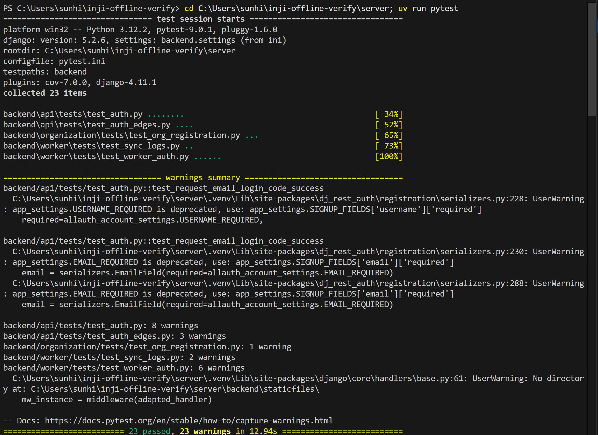

# Testing Guide - Inji Offline Verify Platform

This guide provides comprehensive instructions for testing both the frontend and backend components of the Inji Offline Verify Platform.

---

## Table of Contents
- [Prerequisites](#prerequisites)
- [Quick Start - Run the Application](#quick-start---run-the-application)
- [Backend Testing (Python/Django)](#backend-testing-pythondjango)
- [Frontend Testing](#frontend-testing)
- [Video Demonstration](#video-demonstration)

---

## Prerequisites

Before you begin, ensure you have the following installed on your system:

- **Docker Desktop** (version 20.10 or later)
- **Docker Compose** (version 2.0 or later)
- **Git** (for cloning the repository)

> **Note:** You don't need Node.js, Python, or any other dependencies installed locally. Docker will handle everything!

---

## Quick Start - Run the Application

### Step 1: Clone the Repository

```bash
git clone https://github.com/SartMa/inji-offline-verify.git #switch was not there
git switch SE_project
cd inji-offline-verify
```

### Step 2: Configure Environment Variables

Create a `.env` file in the root directory:

```bash
# On Windows (PowerShell)
Copy-Item .env.example .env

# On macOS/Linux
cp .env.example .env
```

Edit the `.env` file with your configuration:
#
```env
# Database Configuration
DATABASE_URL=postgresql://postgres:postgres@db:5432/inji_verify_db 

# Django Settings
DJANGO_SECRET_KEY=your-secret-key-here-change-in-production
DJANGO_DEBUG=True
DJANGO_ALLOWED_HOSTS=localhost,127.0.0.1,0.0.0.0

# Email Configuration (SendGrid)
EMAIL_BACKEND=django.core.mail.backends.smtp.EmailBackend
EMAIL_HOST=smtp.sendgrid.net
EMAIL_PORT=587
EMAIL_USE_TLS=True
EMAIL_HOST_USER=apikey
EMAIL_HOST_PASSWORD=your-sendgrid-api-key-here
DEFAULT_FROM_EMAIL=noreply@yourdomain.com

# CORS Settings
CORS_ALLOWED_ORIGINS=http://localhost:3011,http://localhost:5173

# Frontend URLs
VITE_API_BASE_URL=http://localhost:8012
VITE_ORG_API_BASE_URL=http://localhost:8012/organization/api
VITE_WORKER_API_BASE_URL=http://localhost:8012/worker/api
```

> **Important:** For email functionality to work (OTP verification), you need a valid SendGrid API key. Sign up at [SendGrid](https://sendgrid.com/) to get one for free.

### Step 3: Build and Start All Services

Ensure Docker Desktop is running, then execute:

```bash
docker compose up --build
```

This command will:
1. Build Docker images for all services
2. Start PostgreSQL database
3. Start Django backend API
4. Start Organization Portal (React frontend)
5. Start Worker PWA (React PWA)

**Wait for all services to start.** You'll see logs indicating services are ready:
- `api_1` → Backend server started
- `organization-portal_1` → Frontend dev server ready
- `worker-pwa_1` → PWA dev server ready

### Step 4: Run Database Migrations

In a **new terminal** window (while Docker services are running):

```bash
# Run database migrations
docker compose exec api python manage.py migrate

# Create a superuser (optional, for Django admin access)
docker compose exec api python manage.py createsuperuser
```

### Step 5: Access the Applications

Once everything is running, open your browser and navigate to:

| Service | URL | Description |
|---------|-----|-------------|
| **Organization Portal** | [http://localhost:3011](http://localhost:3011) | Admin interface for supervisors |
| **Worker PWA** | [http://localhost:5173](http://localhost:5173) | Field worker verification interface |
| **Backend API** | [http://localhost:8012](http://localhost:8012) | Django REST API |
| **Django Admin** | [http://localhost:8012/admin](http://localhost:8012/admin) | Django admin panel |

---

## Backend Testing (Python/Django)

We use **pytest** for comprehensive backend testing with Django REST Framework integration.

### Test Coverage

Our backend test suite includes:

- **Authentication Tests** (23 total tests)
  - Email OTP login flow (request code, verify code, expired/consumed codes)
  - Password reset flow (request, confirm, invalid tokens)
  - Worker authentication (login, registration with role checks)
  - Organization registration and login
  - Log synchronization

### Running Backend Tests Only

To run only the backend tests without building the frontend services:

```bash
# Step 1: Build and start only database and backend services
# This will build the backend Docker image (first time: ~2-3 minutes, subsequent: faster with cache)
docker compose up -d --build database backend

# Step 2: Once backend shows "Application startup complete", run tests (Ctrl+C to exit logs)
docker compose exec backend pytest

# or run with verbose output
docker compose exec backend pytest -v

# Run with coverage report
docker compose exec backend pytest --cov=backend --cov-report=term-missing

# Run specific test file
docker compose exec backend pytest backend/api/tests/test_auth.py

# Run specific test module
docker compose exec backend pytest backend/worker/tests/

# Run specific test function
docker compose exec backend pytest backend/api/tests/test_auth.py::test_request_email_login_code_success

# Step 4: Stop services when done
docker compose down
```

> **Note:** 
> - First build takes 2-3 minutes. Subsequent builds are faster due to Docker layer caching.
> - Only builds the backend service (PostgreSQL image is pre-built, no frontend builds needed).
> - The backend container automatically runs database migrations on startup.

### Test Structure

```
server/backend/
├── api/tests/
│   ├── test_auth.py           # Email OTP & password reset tests
│   └── test_auth_edges.py     # Edge cases (expired codes, invalid UIDs)
├── worker/tests/
│   ├── test_worker_auth.py    # Worker login & registration tests
│   └── test_sync_logs.py      # Verification log sync tests
└── organization/tests/
    └── test_org_registration.py  # Organization registration flow tests
```

### Understanding Test Results

When you run the tests, you'll see output like this:



```bash
========================== test session starts ==========================
platform win32 -- Python 3.12.2, pytest-9.0.1, pluggy-1.6.0
django: version: 5.2.6, settings: backend.settings (from ini)
rootdir: C:\...\inji-offline-verify\server
configfile: pytest.ini
testpaths: backend
plugins: cov-7.0.0, django-4.11.1
collected 23 items

backend\api\tests\test_auth.py ........                           [ 34%]
backend\api\tests\test_auth_edges.py ....                         [ 52%]
backend\organization\tests\test_org_registration.py ...           [ 65%]
backend\worker\tests\test_sync_logs.py ..                         [ 73%]
backend\worker\tests\test_worker_auth.py ......                   [100%]

========================== 23 passed, 23 warnings in 12.94s ==========================
```


**Test Results:**
- **23 passed** = All tests successful
- **23 warnings** = Non-critical deprecation notices from dependencies (safe to ignore)

## Frontend Testing

### Test Cases

We provide a comprehensive collection of test cases with sample Verifiable Credentials in various formats and signature types.

**📁 [Testcases Folder](./Testcases/)**

| Category | Description | Path |
|----------|-------------|------|
| **ECDSA** | ES256, ES384, ES256K signatures | [`Testcases/ecdsa/`](./Testcases/ecdsa/) |
| **Ed25519-2018** | Ed25519Signature2018 | [`Testcases/ed25519-2018/`](./Testcases/ed25519-2018/) |
| **Ed25519-2020** | Ed25519Signature2020 (valid/expired/invalid) | [`Testcases/ed25519-2020/`](./Testcases/ed25519-2020/) |
| **RSA 2018** | RsaSignature2018 | [`Testcases/Rsa2018/`](./Testcases/Rsa2018/) |
| **Revocation** | Revoked credentials + StatusList | [`Testcases/Revocation/`](./Testcases/Revocation/) |
| **Verifiable Presentations** | Valid VP examples | [`Testcases/VP/`](./Testcases/VP/) |

### Video Demonstration

Watch our comprehensive video demonstration showing the complete platform functionality including credential verification, online/offline mode, and revocation checking.

**📺 [Watch Demo on YouTube →](https://www.youtube.com/watch?v=YOUR_VIDEO_ID)**

---

## Video Demonstration

Watch our comprehensive video demonstration showing:
- Complete setup walkthrough
- Organization registration and admin login
- Worker registration and QR code scanning
- Online and offline verification scenarios
- Revocation checking with StatusList
- Verification log synchronization
- Dashboard analytics

### 📺 YouTube Demo Videos

**Full Platform Demo (30 minutes):**
[Watch on YouTube →](https://www.youtube.com/watch?v=YOUR_VIDEO_ID)


## Testing Checklist

### Backend Tests ✅
- [ ] All 23 pytest tests pass
- [ ] No critical errors in logs
- [ ] Database migrations applied successfully

### Frontend Manual Tests ✅
- [ ] Organization registration with email OTP
- [ ] Worker registration by admin
- [ ] QR code scanning (online mode)
- [ ] QR code scanning (offline mode)
- [ ] Valid credential verification
- [ ] Expired credential detection
- [ ] Invalid signature detection
- [ ] Revoked credential detection (with StatusList)
- [ ] Verification log sync to server
- [ ] Dashboard displays logs correctly

### System Integration ✅
- [ ] All Docker services start successfully
- [ ] Frontend can communicate with backend API
- [ ] Database connections work
- [ ] Email sending works (OTP received)
